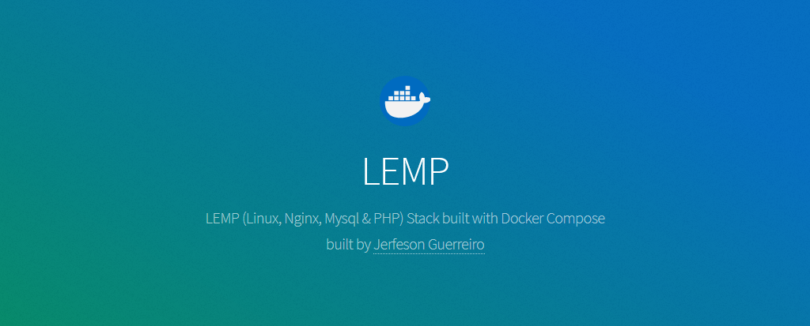

# LEMP (Linux (Ubuntu), Nginx, Mysql & PHP) stack built with Docker Compose

This is a basic LEMP stack environment built using Docker Compose. It consists following:

- PHP 7.3.X (More later)
- Nginx
- MySQL
- phpMyAdmin
- Redis

## Use appropriate branch as per your php version needed:

* [7.3.x](https://github.com/jerfeson/docker-compose-lemp/tree/7.3.x)

## Configuration and Usage

Please read from appropriate version branch.

## Contributing

welcome to discuss a bugs, features and ideas.

## License

jerfeson/docker-compose-lemp is release under the MIT license.
